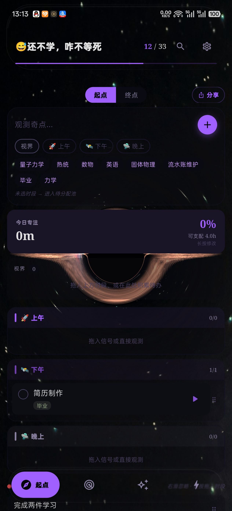
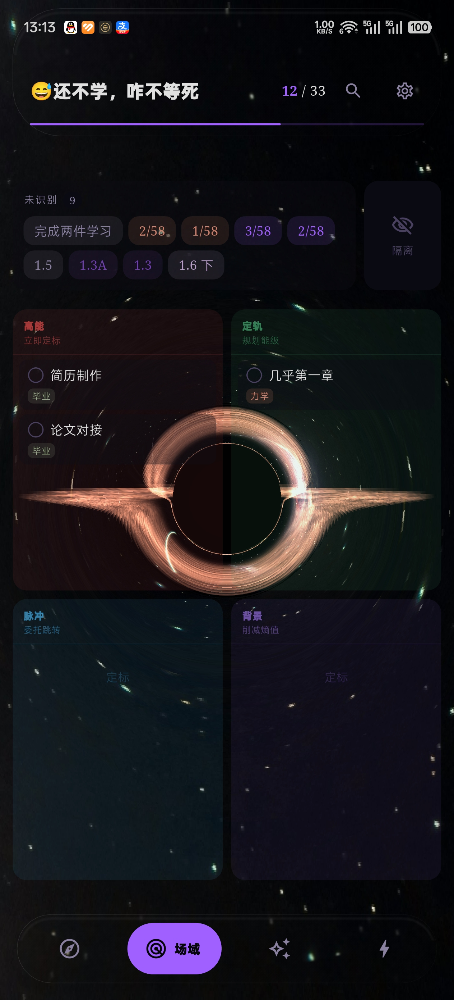
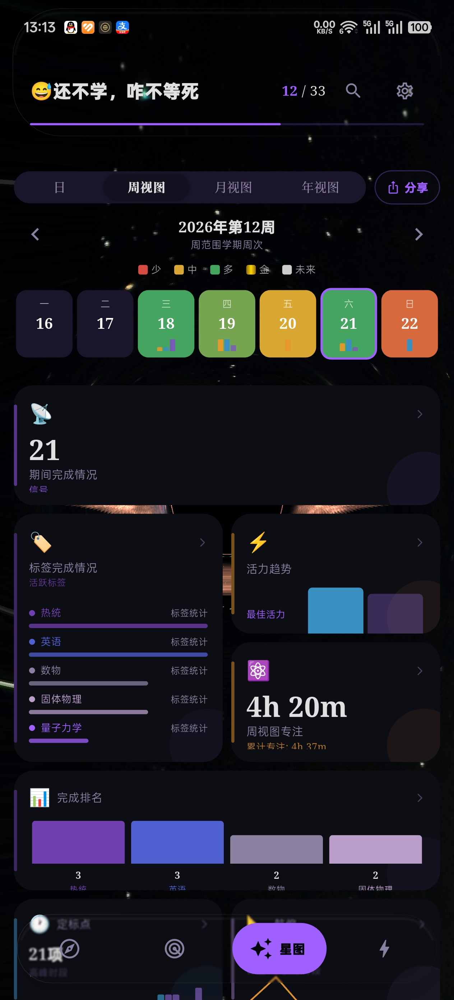
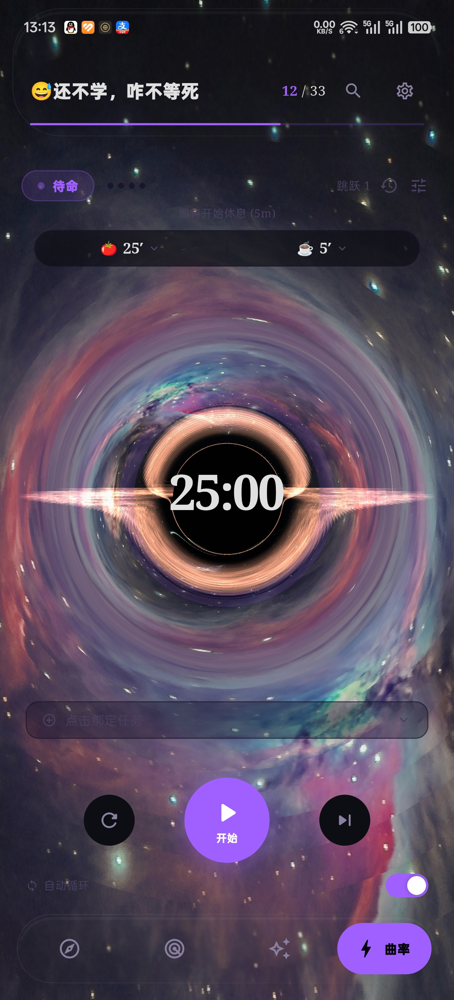
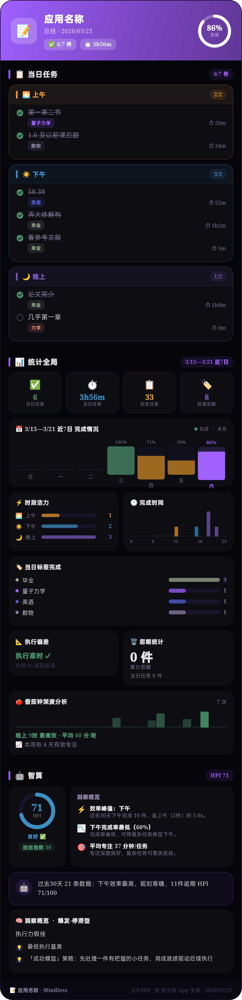

# Mindless (流水账)

> **⚠️ 醒目声明**：
> **整个 App 都是 AI 做的，作者没有阅读一丁半点的代码，开源协议是瞎选的。**

Mindless 是一款基于 Flutter 开发的极简主义任务管理与专注工具。它结合了任务管理、番茄钟专注以及深度的心理与效率分析，旨在帮助用户在快节奏的生活中找回专注力，并建立良好的习惯反馈循环。

## ✨ 核心特性

- **任务管理**：极简的任务录入与分类，支持四象限法则。
- **专注模块**：内置番茄钟，支持沉浸式背景音与心流状态分析。
- **智能建议 (Smart Plan)**：基于行为数据的心理学洞察，提供针对性的效率改进建议。
- **环境声检测**：实时监测环境噪音，辅助寻找最佳专注环境。
- **数据可视化**：多维度的活力统计、完成分布及预估偏差分析。
- **多语言支持**：完整的国际化方案，支持中文与英文。

## 📸 界面展示

### 1. 起点 (Main) - 实时黑洞视觉仪表盘
追踪今日专注时长与可用时间，按早中晚时段科学排程。
<br>


---

### 2. 场域 (Quadrants) - 引力四象限场域
独特的任务优先级管理视图，根据“能量”与“轨道”智能分区。
<br>


---

### 3. 星图 (Stats) - 全维度数据分析
深度分析活力趋势、标签分布，让你的进步清晰可见。
<br>


---

### 4. 曲率 (Pomodoro) - 沉浸式曲率计时器
视觉化时间扭曲效果，实时监测“心流指数”与专注质量。
<br>


---

### 5. 智算 (Smart Plan) - 智算分析报告
全量汇总任务、统计与心理洞察，提供针对性的效率改进建议。
<br>


---

## 🛠️ 技术栈

- **框架**: Flutter
- **语言**: Dart
- **状态管理**: Provider / ChangeNotifier
- **数据持久化**: SharedPreferences / Hive
- **架构**: Headless UI Adapter Pattern (基于类型安全的国际化与展示协议)

## ⚖️ 开源协议与声明

本项目采用 **GNU Affero General Public License v3.0 (AGPL-3.0)** 开源协议。

### 引用与致谢 (Credits)

Mindless 的开发参考了以下优秀开源项目，在此表示诚挚的感谢：

1.  **[Tomato](https://github.com/nsh07/Tomato)** (作者: nsh07):
    - 本项目参考了 Tomato 的核心番茄钟引擎逻辑及其简洁的交互设计。
2.  **[black-hole-simulation](https://github.com/chrismatgit/black-hole-simulation)** (作者: chrismatgit):
    - 本项目参考了该项目中的视觉特效与物理模拟逻辑，用于打造沉浸式的“黑洞”专注主题。

## 🚀 快速开始

### 前置要求

- Flutter SDK (>= 3.3.0)
- Dart SDK (>= 3.3.0)

### 安装步骤

1. 克隆仓库:
   ```bash
   git clone https://github.com/KL2333/Mindless.git
   ```
2. 安装依赖:
   ```bash
   flutter pub get
   ```
3. 运行项目:
   ```bash
   flutter run --release
   ```

---

Copyright (c) 2026 KL2333. Built with ❤️ for deep focus.
